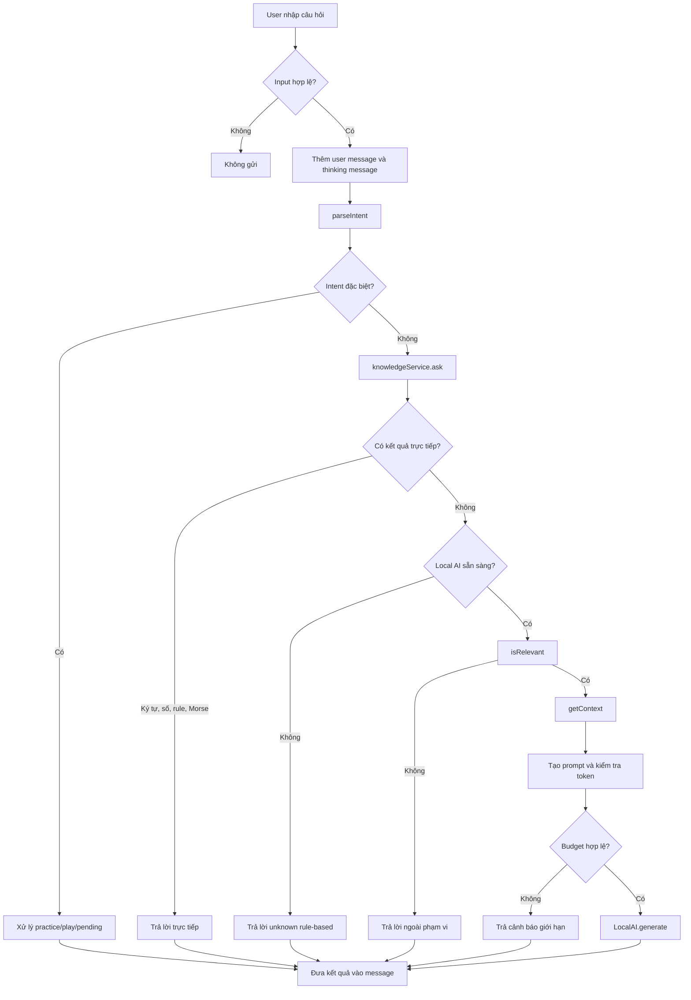

# Chat Screen - Flow Hoạt Động

## Tổng quan

Chat Screen là giao diện chat với AI assistant "Mori". Luồng xử lý ưu tiên
rule-based từ knowledge base Morse trước, chỉ gọi mô hình Qwen local
(llama.cpp) qua RAG (Retrieval-Augmented Generation) khi chưa có câu trả lời
trực tiếp.

## Sơ đồ luồng hiện tại



Thứ tự quan trọng: `parseIntent()` được kiểm tra trước, sau đó
`knowledgeService.ask()` được kiểm tra trước RAG. Vì vậy các câu hỏi đã có
đáp án trong knowledge base không cần chạy inference local.

## Architecture

```
┌─────────────────────────────────────────────────────────────┐
│                       ChatScreen                            │
├─────────────────────────────────────────────────────────────┤
│  ┌─────────┐    ┌──────────────┐    ┌──────────────────┐   │
│  │  Input   │───▶│  handleSend  │───▶│   FlatList       │   │
│  └─────────┘    └──────────────┘    │   (Messages)     │   │
│                                     └──────────────────┘   │
│                                              ▲              │
│                                              │              │
│  ┌──────────────────────────────────────────┴───────────┐  │
│  │                    RAG Pipeline                       │  │
│  │  ┌─────────────┐  ┌─────────────┐  ┌─────────────┐  │  │
│  │  │ isRelevant  │─▶│ getContext  │─▶│   generate   │  │  │
│  │  │  (Filter)   │  │ (Retrieval) │  │   (LLM)     │  │  │
│  │  └─────────────┘  └─────────────┘  └─────────────┘  │  │
│  └──────────────────────────────────────────────────────┘  │
└─────────────────────────────────────────────────────────────┘
```

## Flow Chi Tiết

### 1. Khởi Tạo (Mount)

```
useEffect → handleInitialize()
    │
    ├──▶ useLocalAIStore.initialize()
    │       ├── prepare()     → Copy model từ bundle sang device
    │       └── loadModel()   → Load model vào native (llama.cpp)
    │
    └──▶ Update message: "Xin chào! Mình là Mori..."
```

### 2. Gửi tin nhắn (`handleSend`)

```
User nhập text → Nhấn Send
         │
         ▼
┌─────────────────────────────────────────┐
│ 1. Tạo userMessage + thinkingMessage    │
│    thinkingMessage.text = '...'         │
│    → Hiển thị TypingIndicator           │
└─────────────────────────────────────────┘
         │
         ▼
┌─────────────────────────────────────────┐
│ 2. Parse intent và kiểm tra trạng thái chờ│
│    pendingPlayChar / pendingIntent       │
│    / pendingNumber                        │
└─────────────────────────────────────────┘
         │
         ▼ (RAG flow)
┌─────────────────────────────────────────┐
│ 3. Rule-based trước RAG                  │
│    knowledgeService.ask(text)            │
│    ├── character/rule/decode → trả lời   │
│    └── unknown → tiếp tục kiểm tra RAG   │
└─────────────────────────────────────────┘
         │
         ▼
┌─────────────────────────────────────────┐
│ 4. Scope Filter                         │
│    knowledgeService.isRelevant(text)    │
│    ├── false → REPLIES.OUT_OF_SCOPE     │
│    └── true  → Tiếp tục RAG             │
└─────────────────────────────────────────┘
         │
         ▼
┌─────────────────────────────────────────┐
│ 5. Retrieval                            │
│    knowledgeService.getContext(text)     │
│    ├── _extractTargetCharacter()        │
│    │   └── Parse: "chữ C" → "C"         │
│    ├── _findRelevantRules()             │
│    │   └── Match keywords → Rules       │
│    └── Return context string            │
└─────────────────────────────────────────┘
         │
         ▼
┌─────────────────────────────────────────┐
│ 6. Build Prompt                         │
│    fullPrompt = `Context: ${context}    │
│                  Câu hỏi: ${text}`      │
│    Truncate nếu > 800 chars             │
└─────────────────────────────────────────┘
         │
         ▼
┌─────────────────────────────────────────┐
│ 7. Token Budget Check                   │
│    checkTokenBudget(system, user, 128)  │
│    ├── MAX_INPUT = 2048 tokens          │
│    ├── MAX_TOTAL = 2048 tokens          │
│    └── ok = false → Warning message     │
└─────────────────────────────────────────┘
         │
         ▼
┌─────────────────────────────────────────┐
│ 8. Generate (Native)                    │
│    generate(systemPrompt, fullPrompt)   │
│    │                                    │
│    ▼                                    │
│  ┌────────────────────────────────────┐ │
│  │ LocalAIModule.java                 │ │
│  │   └── LlamaNative.generate()       │ │
│  │                                    │ │
│  │ llama_native.cpp                   │ │
│  │   ├── Format chat template         │ │
│  │   ├── Tokenize prompt              │ │
│  │   ├── llama_init_from_model()      │ │
│  │   ├── llama_decode() (chunked)     │ │
│  │   └── Sample tokens (greedy)       │ │
│  └────────────────────────────────────┘ │
└─────────────────────────────────────────┘
         │
         ▼
┌─────────────────────────────────────────┐
│ 9. Update Messages                      │
│    Replace thinkingMessage with reply   │
│    scrollToBottom()                     │
└─────────────────────────────────────────┘
```

### 3. Rule-based flow

```
knowledgeService.ask(text)
    │
    ├──▶ /^[.\-\s]+$/.test(text) → Decode Morse
        ├──▶ /^[a-z]$/.test(text)    → Find character
        ├──▶ số đơn lẻ               → Hỏi số thường / số tắt nếu cần
        ├──▶ /chữ|ký tự|morse/       → Find character
        ├──▶ text.includes('báo vụ') → Rule: Báo vụ
        ├──▶ text.includes('tích')   → Rule: Tích
        ├──▶ text.includes('tà')     → Rule: Tà
        ├──▶ text.includes('sos')    → SOS decode
    └──▶ default                 → Unknown message
```

Các kết quả có type `character`, `rule` hoặc `morse_decode` được
`ChatScreen` trả thẳng ra giao diện. Chúng không đi qua `isRelevant()` hay
`LocalAI.generate()`.

### 4. RAG và local AI

RAG chỉ chạy khi `ask()` trả về `unknown` và model đã sẵn sàng:

1. `isRelevant(text)` kiểm tra câu hỏi có chứa chủ đề Morse/báo vụ hay không.
     Các chữ cái đơn lẻ không còn là keyword, tránh nhận nhầm các câu như
     `O ye`, `A yo` hoặc `Y yo`.
2. `getContext(text)` lấy ký tự hoặc rule liên quan từ knowledge base.
3. Nếu không có dữ liệu cụ thể, context để trống; không tự chèn danh sách
     `A=.-, B=-...` vào prompt.
4. Prompt gồm context và câu hỏi người dùng, bị giới hạn tối đa 800 ký tự.
5. `checkTokenBudget()` kiểm tra prompt trước khi gọi native model.
6. `generate()` gọi `LocalAI.generate()` với tối đa 128 token output.

### 5. Các trạng thái chờ trong hội thoại

- `pendingPlayChar`: sau khi hỏi thông tin một ký tự, bot chờ người dùng xác
    nhận phát âm. Các câu như `có`, `ok`, `yes`, `nghe` sẽ phát audio Morse.
- `pendingNumber`: sau khi người dùng hỏi số có dạng thường và số tắt, bot chờ
    lựa chọn `thường` hoặc `tắt`.
- `pendingIntent`: dùng khi người dùng yêu cầu mở bài luyện nhưng còn thiếu
    tham số như số nhóm, loại ký tự hoặc tốc độ.
- `isGenerating`: khóa gửi tin nhắn mới trong lúc đang xử lý câu hiện tại.

## Ví dụ minh họa

### Ví dụ 1: Câu hỏi có đáp án rule-based

```text
User: Báo vụ là gì?
```

Luồng:

```text
handleSend
    -> parseIntent: ask_morse
    -> knowledgeService.ask
    -> type = rule
    -> trả lời trực tiếp
```

Kết quả dự kiến:

```text
Báo vụ là việc truyền, nhận và ghi nhận thông tin bằng tín hiệu Morse,
thường được sử dụng trong liên lạc vô tuyến.
```

Không gọi RAG và không sinh bảng Morse mẫu.

### Ví dụ 2: Hỏi một ký tự

```text
User: Chữ O trong Morse là gì?
```

`knowledgeService.ask()` tìm entry `O` và trả về mã `---`. Chat hiển thị thông
tin ký tự rồi hỏi thêm người dùng có muốn phát tín hiệu hay không. Nếu user
trả lời `có`, `playMorseSignal()` phát mã `---` qua `morseAudio`.

### Ví dụ 3: Hỏi số có hai biến thể

```text
User: Số 8 là gì?
```

Vì số `8` có mã thường và mã số tắt, bot chưa chọn ngay mà đặt
`pendingNumber = "8"`:

```text
Bot: Bạn muốn hỏi số 8 thường hay số 8 tắt?
User: số tắt
Bot: Tín hiệu số 8 tắt là -..
```

### Ví dụ 4: Câu ngoài phạm vi hoặc câu vô nghĩa

```text
User: O ye
```

`ask()` không tìm thấy dữ liệu, nhưng `isRelevant()` cũng trả về `false` vì
không có keyword Morse hợp lệ. Bot trả lời `REPLIES.OUT_OF_SCOPE` và không
gọi local model, nên không xuất hiện câu trả lời Morse dài hoặc vô nghĩa.

### Ví dụ 5: Câu hỏi cần RAG

```text
User: Tốc độ phát Morse bao nhiêu là phù hợp?
```

Nếu `ask()` chưa có câu trả lời trực tiếp và local model đã sẵn sàng:

```text
isRelevant
    -> getContext: lấy rule về tốc độ phát
    -> build fullPrompt
    -> checkTokenBudget
    -> LocalAI.generate(..., maxTokens = 128)
    -> hiển thị câu trả lời của model
```

Nếu model chưa sẵn sàng, bot dùng câu trả lời rule-based hoặc thông báo lỗi
thay vì cố gọi inference.

### Ví dụ 6: Yêu cầu mở bài luyện

```text
User: Cho tôi thu 5 nhóm chữ cái tốc độ 100 chữ/phút
```

`parseIntent()` nhận diện `practice_electro`, lấy các tham số:

```json
{
    "groupCount": 5,
    "characterType": "letter",
    "cpm": 100
}
```

Chat hiển thị lời xác nhận và tạo action button để điều hướng tới màn hình
`ElectricBoardScreen`. Nhánh này không đi qua RAG.

## Components

### TypingIndicator
- 3 dots animated sóng biển
- Dots bounce lên xuống với delay staggered (0ms, 150ms, 300ms)
- Dùng `Animated.loop` + `useNativeDriver: true`

### MessageItem (memo)
- Memoized component, chỉ re-render khi item thay đổi
- Bot message: avatar Mori + bubble trắng
- User message: bubble xanh lá, căn phải

### FlatList (Virtualization)
```tsx
removeClippedSubviews={true}  //卸载 offscreen views
maxToRenderPerBatch={10}       // 10 items/batch
windowSize={5}                  // 5 screens ahead
initialNumToRender={10}         // 10 items đầu
```

## Constants (config.ts)

```typescript
export const AI_NAME = "Trợ lý Mori";

export const REPLIES = {
  OUT_OF_SCOPE: 'Xin lỗi, mình chỉ hỗ trợ về mã Morse...',
  MODEL_LOADING: 'Đang tải model, vui lòng chờ...',
  MODEL_ERROR: 'Không thể tải model. Vui lòng thử lại.',
  GENERATE_ERROR: 'Xin lỗi, mình không thể trả lời lúc này.',
  TOKEN_LIMIT: 'Câu hỏi quá dài. Vui lòng rút gọn.',
};
```

## Token Budget

| Component | Max Tokens |
|-----------|-----------|
| System Prompt | ~100 |
| Context + Question | ~500 |
| Output (maxTokens) | 256 |
| **Tổng** | **~1024** |

## Safety Layers

1. **Input limit**: `maxLength={200}` trên TextInput
2. **Prompt truncation**: `MAX_PROMPT_LENGTH = 800` chars
3. **Token budget check**: `checkTokenBudget()` trước khi generate
4. **Native truncation**: `maxCtx = 2048` tokens, truncate nếu vượt
5. **Chunk decode**: Chia prompt thành batches ≤ `n_batch`

## Files

```
src/
├── screens/Chat/
│   └── ChatScreen.tsx          # Main chat UI
├── components/
│   └── TypingIndicator/
│       ├── index.ts
│       └── TypingIndicator.tsx  # Animated typing dots
├── store/
│   └── localAIStore.ts          # Zustand store (generate, initialize)
├── ai/
│   ├── KnowledgeService.js      # RAG: isRelevant, getContext, checkTokenBudget
│   ├── knowledgeBase.js         # Knowledge base loader
│   ├── knowledge/
│   │   ├── morse_basic.js       # A-Z, 0-9 entries
│   │   └── morse_rules.js       # Rules (tích, tà, SOS, WPM...)
│   └── prompts.ts               # System prompt for Qwen
├── constants/
│   └── config.ts                # AI_NAME, REPLIES, APP_NAME
└── assets/
    └── images/
        └── mori.png             # Avatar
```

## Native Layer

```
LocalAIModule.java
    └── generate(systemPrompt, prompt, maxTokens)
            │
            ▼
LlamaNative.java (JNI)
    └── native generate(modelHandle, system, user, maxTokens)
            │
            ▼
llama_native.cpp
    ├── Format chat template (Qwen format)
    ├── Tokenize → promptTokens
    ├── n_ctx = max(512, promptTokens + maxTokens + 1)
    ├── n_batch = max(512, min(promptTokens, 1024))
    ├── llama_decode() in chunks
    └── Sample greedy → output string
```
